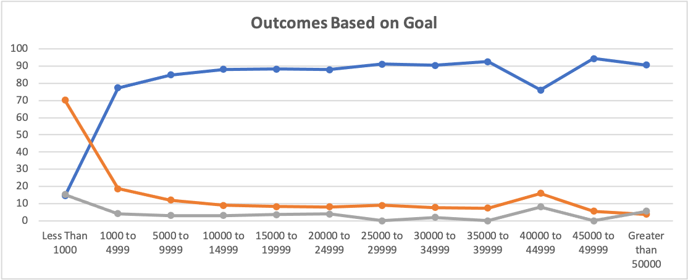

# Kickstarting with Excel

## Overview of Project
Analyses were performed on a Kickstarter campaigns data set to help Louise make decisions on her project. The first analysis showed the relationship between “Theater Outcome” and “Launch Date” and the second analysis showed the relationship between “Outcomes” and “Goals”.

### Purpose
The purpose of the analyses was to find trends between the outcome of the pledges, goals, the dollar amount fundraised and its launch date.

## Analysis and Challenges
The operational variable in the analyses were the count of outcomes, each value was counted by its frequency resulted in “successful”, “Failed” and “Canceled”. Successful indicates that the pledge has met or surpassed the goal amount, failed indicates that the pledge amount did not meet the goal amount and canceled indicates that the campaign was terminated in the process of fundraising.

### Analysis of Outcomes Based on Launch Date
The independent variable “Launch Date” was converted from Unix timestamp into a day-month-year format. The dates were further filtered by months of a year for analysis. A line chart was generated to show “Outcomes by Launch Date” below (attached photo 1).

### Analysis of Outcomes Based on Goals
The independent variable “Goal” was segmented into 12 categories, “Less than 100,” “1000 to 4999”, “5000 to 9999”, “1000 to 14999,” “15000 to 19999,” “20000 to 249999,” “25000 to 29999,” “30000 to 349999,” “35000 to 39999,” “40000 to 44999,” “45000 to 49999” and “Greater than 50000.” A correlation analysis was performed to show the relationship between the goal amount and its success rate. The outcome variable was converted into percentages of success, failure and cancelled for comprehensive analysis. A line chart was generated to show “Outcomes Based on Goal” below.

### Challenges and Difficulties Encountered
The time format for “Launch Date” would pose as a challenge if it was used as metrics to operationalize time. To make sure that Excel is able to process the measurement of time, it was necessary to convert it from UNIX to a more legible format for analysis. I also found that segmenting goals into categorical brackets to be very useful to measure its success rate to help make decisions on setting goals for Louise’s Kickstarter campaign. Without the incremental indications, it would be hard to understand the feasibility of her fundraising metrics.

## Results
### Outcome based on Launch Date
There range for successful events were between 35 to 111 from January to December, the range for failed events were between 31 to 52 and the range for canceled events were between 0 to 7. The month that launched the most successful Kickstarter campaigns was May and the least successful campaign was December. The chart shows that campaigns launched between May to July (beginning of summer) were the most successful and shows a decline in success in the following months. In October, there is a marginal increase in success, however failure rate followed with the increase of campaigns launched. The chart also shows that campaigns launched in May has the greatest gaps between successful campaigns than failed campaigns. Canceled events showed to be almost linear with no data entry for the month of October. In conclusion, Louise should launch her campaign in May and avoid October to optimize the chance of success for her campaign.

### Outcome based on Goals
There is a steep increase in success for campaigns launched with goals more than 1000 dollars and the data shows that the success rate percentage is retained to be in the small range bracket of 77.3% (1000 to 4999) to 94.4% (45000 to 49999). There is a heavy drop of failure for campaigns launch with goals more than 1000 dollars and the data shows that the failure rate percentage also falls in a small range bracket of 3.7% (Greater than 50000) to 18% (1000 to 4999). The percentage in canceled campaigns showed marginal differences between 0%(25000 to 29999/45000 to 49999) to 15.3%(Less Than 1000). In conclusion, Louise should set a fundraise goal above 1000 to optimize the successful rate for her campaign.

### Future analysis
Backer count and amount pledged for sucessful campaigns can also be graphed to show how much each individual backers are willing to fund for each theatre related campaigns. Further more, Analysis can also vet if staff picked campaigns are more likely to suceeed than non staff picked campaignes.
